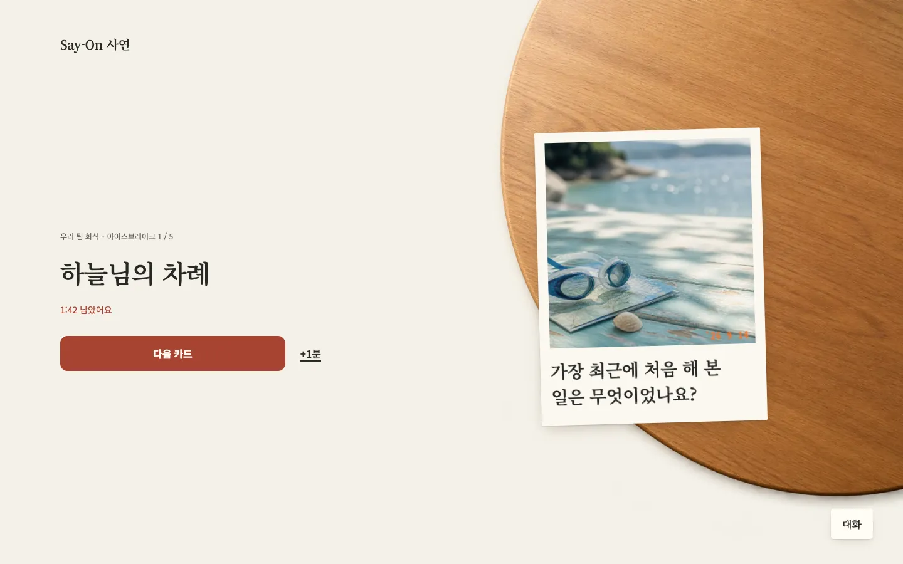
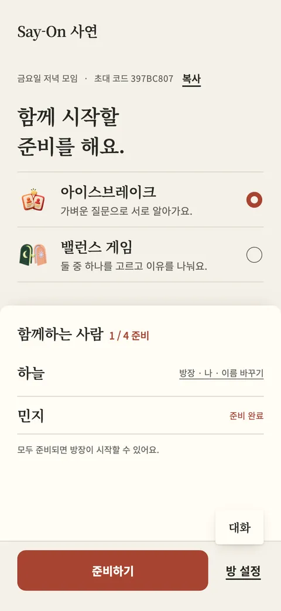
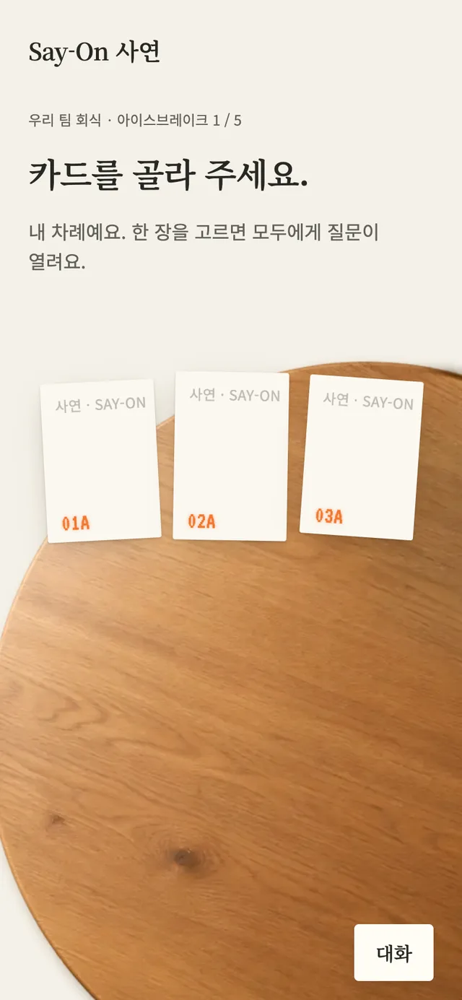
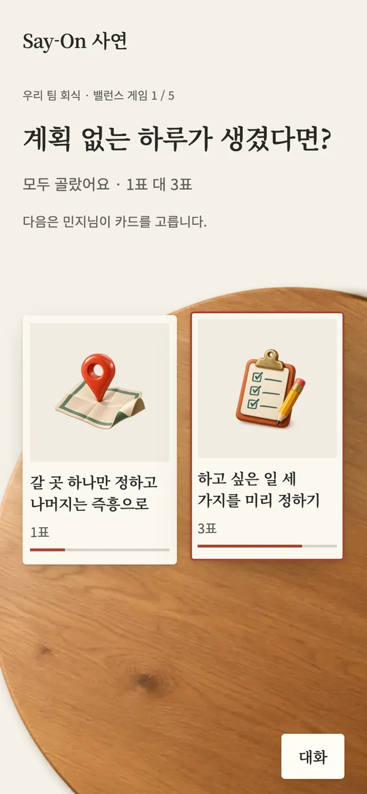
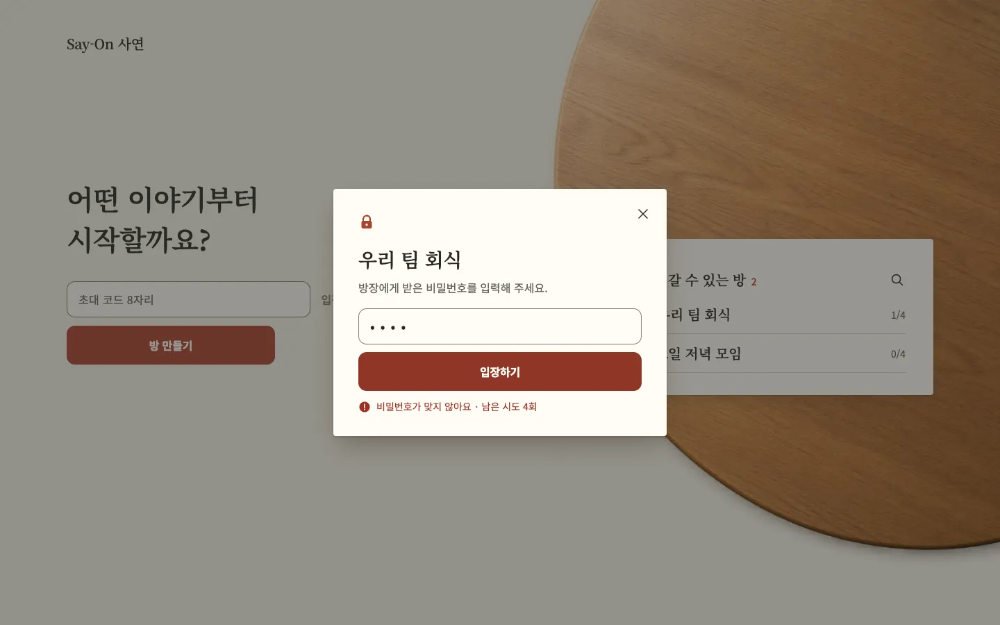

<h1 align="center">Say-On 사연</h1>

<b>A conversation card game for any group, played at one shared table.</b> 
For friends, clubs, teams, classrooms and first meetings: open a room, draw a question, and talk.

  

  

Play in the browser, no install or sign-up: <a href="https://say-on.vercel.app"><b>say-on.vercel.app</b></a> · Best with two or more phones in the same room.

---

## The idea

**사연** is the story behind what someone chooses. **Say on** is an invitation to keep speaking.
Say-On puts one small, good question on the table and then gets out of the way. Everything that matters is an object on a shared wooden table: the question is a film print, a Balance choice is a card, and the chat is slips of paper passed across.

## How it works

<table>
  <tr>
    <td align="center" width="33%"><b>1 · 방 고르기</b> Open a room, or pick one from the live list.</td>
    <td align="center" width="33%"><b>2 · 게임 정하기</b> The host chooses Icebreaker or Balance.</td>
    <td align="center" width="33%"><b>3 · 이야기하기</b> Everyone sees the same question at once.</td>
  </tr>
  <tr>
    <td align="center"></td>
    <td align="center"></td>
    <td align="center"></td>
  </tr>
</table>

## Two games

<table>
  <tr>
    <td width="50%" valign="top"><b>아이스브레이크</b> · 17 open questions on film prints Three prints lie face down. The turn owner picks one, it turns over, and the question opens for the whole room with a talking timer.</td>
    <td width="50%" valign="top"><b>밸런스 게임</b> · 60 everyday choices, 120 illustrations Each card back shows its two objects. Everyone picks a side, and the votes appear only when all have chosen.</td>
  </tr>
  <tr>
    <td align="center"></td>
    <td align="center"> </td>
  </tr>
</table>

## Chat that stays out of the way

<table>
  <tr>
    <td width="40%" align="center"></td>
    <td width="60%" valign="middle">The chat is closed until you tap <b>대화</b>, with a small count for new messages. Open, the conversation reads like slips of paper passed across the table, and the message field is ready to type.</td>
  </tr>
</table>

## Rooms that feel private

- **A live room list** on the first page: only rooms you can join, with search by name.
- **An optional 4 to 12 digit password** set by the host, checked on every way in, with a pause after five wrong tries.
- **Rooms clean themselves up** after 15 minutes without activity.

## Design notes

| Decision | Why |
| --- | --- |
| **The table is the stage** | One focal point per screen: the words sit on the paper margin, the object you act on lies on the table. |
| **Film prints for photos, a card deck for illustrations** | The Icebreaker photos are real photographs, so they are prints with a date imprint. The Balance art is illustration, so it is a clean card deck. |
| **One filled button per screen** | The next action is never in doubt; everything else is quiet text. |
| **Motion explains, never decorates** | Cards are dealt, lifted, turned over and slid away; with reduced motion they simply fade. |
| **Designed in Figma** | Screens and states are drawn at 390 and 1440 px, then built to match. |

## Built with

React 19 · TypeScript · Supabase (Postgres, Realtime, anonymous auth) · Vercel

151 automated tests · a four-browser real-time rehearsal on the live site (30 of 30 checks) · keyboard and reduced-motion support · phone and desktop layouts

Source code is private. © EricEremos. All rights reserved.

