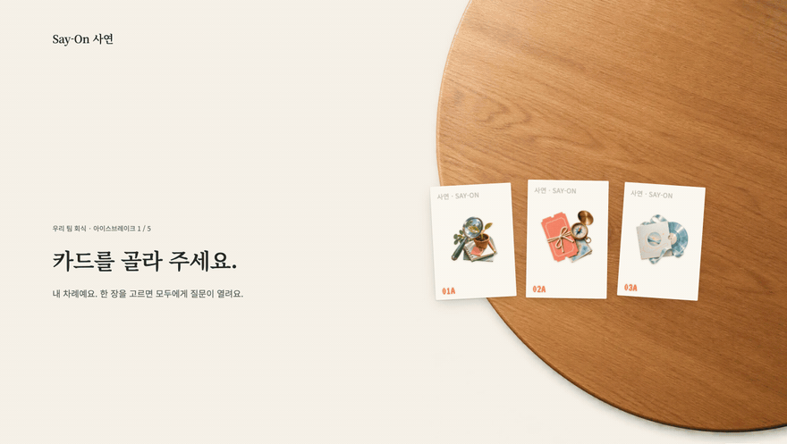
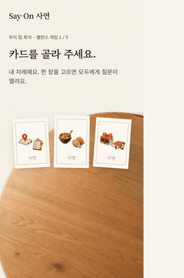
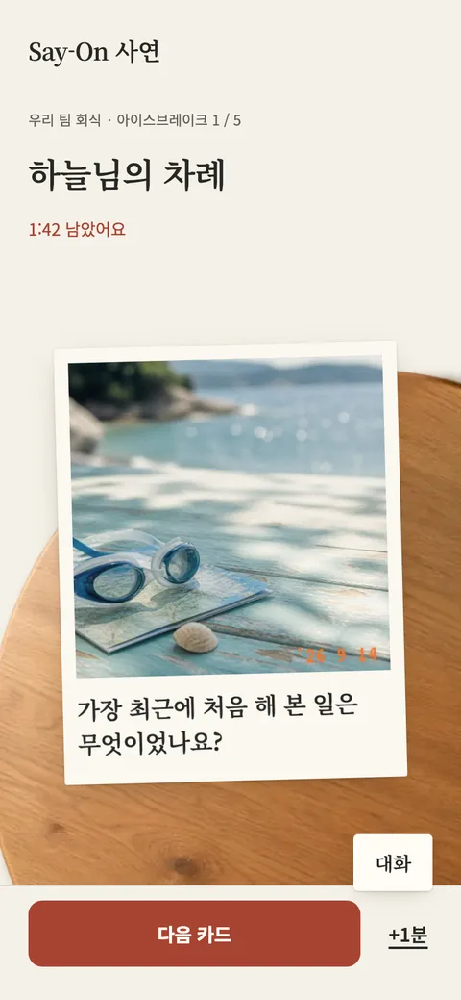
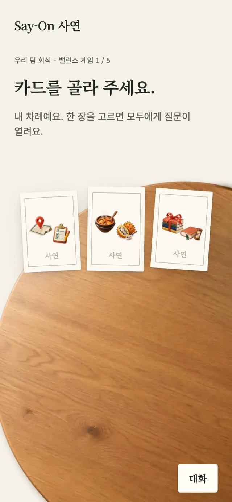
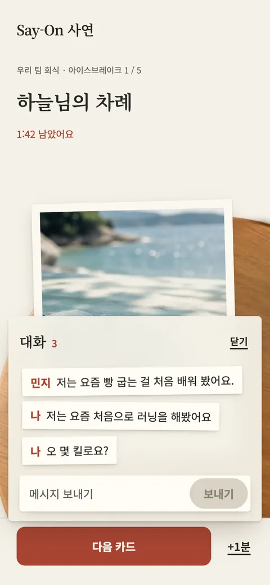
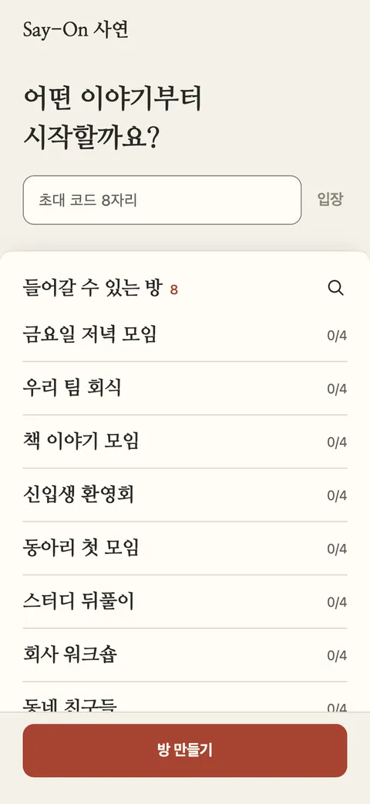

  

<h1 align="center">Say-On 사연</h1>

  <i>Every choice has a story.</i> 
  A card game for talking. One table, one question, the whole room.

  <a href="https://say-on.vercel.app"><b>Play in your browser →</b></a> 
  No install, no sign-up. Best with two or more phones in the same room.

 

**사연** is the story behind a choice, the kind you tell when someone asks *why*.
**Say on** means *keep talking*.

Say-On puts one small, good question on the table and then gets out of the way. There is no feed, no score and no winner: just cards on a wooden table, dealt to the people sitting around it.

 

## A round

<table>
  <tr>
    <td width="42%" align="center"></td>
    <td valign="middle">
      <b>Someone opens a room</b> and shares the invite code, or you pick a room from the list on the first page.  
      <b>Three cards are dealt.</b> Whoever's turn it is picks one, and it turns over for everyone at the same moment.  
      <b>Then you talk.</b> In Balance, everyone quietly picks a side. The votes stay hidden until the last person chooses, then both cards turn and the count appears.
    </td>
  </tr>
</table>

## Two decks

<table>
  <tr>
    <td width="50%" align="center"></td>
    <td width="50%" align="center"></td>
  </tr>
  <tr>
    <td valign="top"><b>아이스브레이크</b> 17 open questions, each on a film print with its own photograph and the date it was opened. The turn owner has a few minutes to answer; the host moves on.</td>
    <td valign="top"><b>밸런스 게임</b> 60 everyday dilemmas, from <i>계획 없는 하루가 생겼다면?</i> to <i>메뉴를 고른다면?</i> Each card back shows its two objects, drawn as a small set of 120 illustrations.</td>
  </tr>
</table>

## Talking, without leaving the table

<table>
  <tr>
    <td width="42%" align="center"></td>
    <td valign="middle">The chat stays closed until you tap <b>대화</b>. A small number tells you something new arrived. Open it and the conversation reads like slips of paper passed across the table.  Rooms can have a 4 to 12 digit password set by the host, and a quiet room clears itself away after 15 minutes.</td>
  </tr>
</table>

 

  

  <a href="https://say-on.vercel.app"><b>say-on.vercel.app</b></a>

 

Designed in Figma and built with React and Supabase Realtime by <a href="https://github.com/EricEremos">EricEremos</a>. The source code is private.

