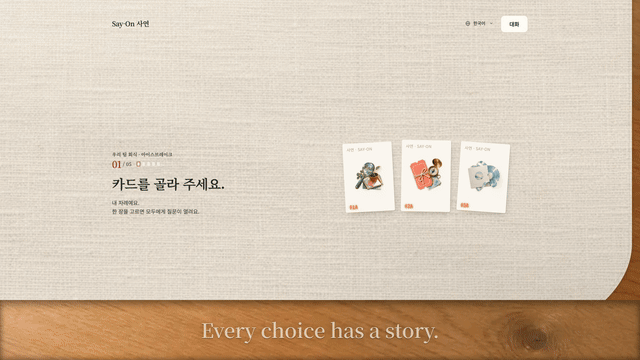
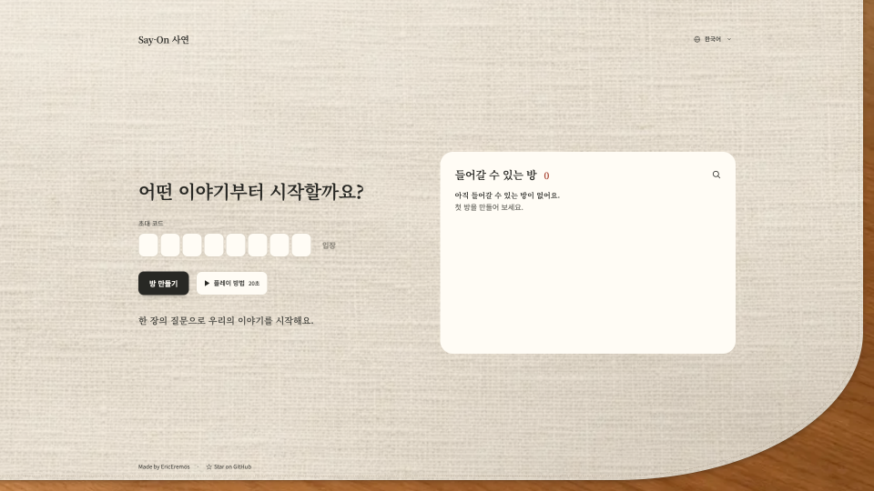
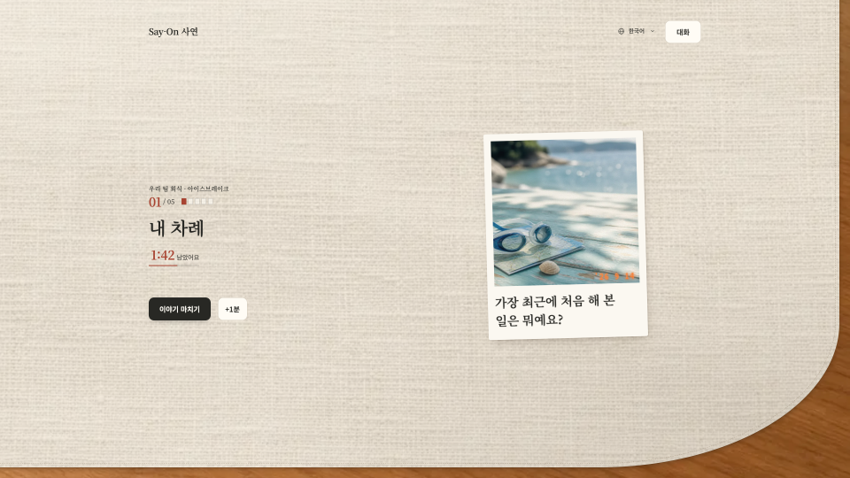
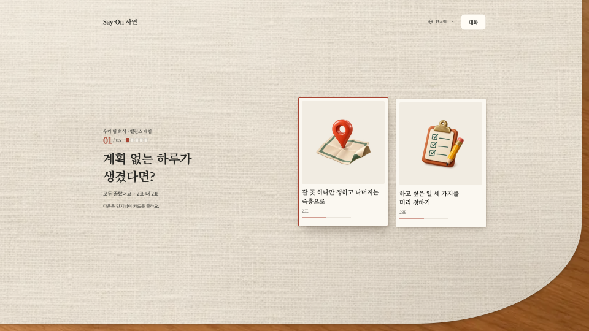
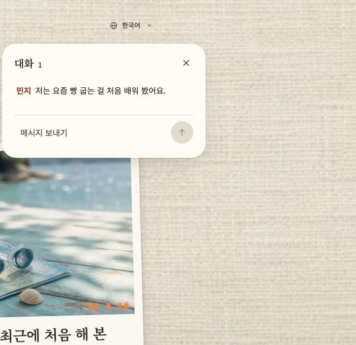

<h1 align="center">Say-On 사연</h1>

  <b>Every choice has a story.</b> 
  A card game for talking. One table, one question, the whole room.

  <a href="https://say-on.vercel.app"><b>Play in your browser →</b></a> 
  No install, no sign-up. Best with two or more phones in the same room.

The app's newest screens (5 November 2026), recorded in a local run with no backend: the lobby and the app's own sample room. No live room was opened. Play it in your browser at say-on.vercel.app. <a href="assets/say-on-promo-20261114.mp4">Watch the full film</a> · <a href="assets/say-on-promo-20261114-poster.png">Still frame</a> · <a href="assets/say-on-promo-20261114-manifest.json">Capture details</a>

**사연** is the story behind a choice—the kind you tell when someone asks *why*. **Say on** means *keep talking*.

Say-On gives the people around a table something to start with. Pick a question, hear an unexpected answer and follow the conversation wherever it goes. There is no feed, score or winner.

## Bring everyone to the same table

  

One person opens a room and shares its invite code. Everyone else joins from their own phone, or chooses a room from the list. The host can add a 4 to 12 digit password; a quiet room clears itself away after 15 minutes.

## Pick a card. Give it a moment.

Three cards arrive on the table. The person whose turn it is picks one, and it opens for everyone at the same moment. What happens next depends on the deck.

### Tell a story · 아이스브레이크

  

17 open questions, each with a photograph and the date it was opened. The current speaker has a few minutes to answer before the host moves on. A small question—*What was the last thing you tried for the first time?*—can lead somewhere no one expected.

### Choose a side · 밸런스 게임

  

60 everyday dilemmas, illustrated with 120 objects. Everyone chooses privately; the votes stay hidden until the last person answers. Both cards then turn over and the count appears. The result starts the conversation: *Why that one?*

## Keep the conversation close

  

Tap **대화** to open the chat without leaving the question. Messages appear like slips of paper passed across the table, and an unread count lets you know when someone has added something.

## The thought behind the table

The wooden surface, film prints and illustrated choices give each round something tangible to gather around. Synchronized turns keep the group on the same question; hidden votes let each person make their own choice before seeing the room's answer.

I designed Say-On in Figma and built it with React and Supabase Realtime. This showcase follows the interaction from joining a room to revealing a choice, so you can see how the visual decisions and the multiplayer behaviour work together.

  <a href="https://say-on.vercel.app"><b>Start a conversation →</b></a>

About the screens and source

The screens and the film on this page come from the app's newest interface (5 November 2026), run locally on 14 November 2026 with no backend: the lobby, and the app's own sample rooms (하늘, 민지, 지수) that it ships for design checks. The card journey, the chat and the vote in the film are the app's own motion, recorded. The source code is private.

Designed and built by <a href="https://github.com/EricEremos">EricEremos</a>.

